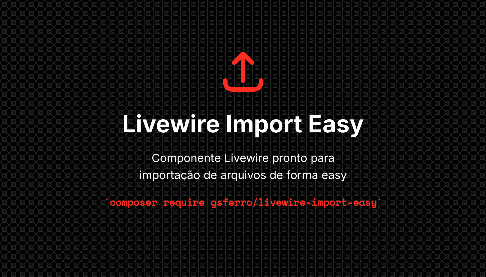

<p align="center">
    
    <p align="center">
        <a href="https://packagist.org/packages/gsferro/livewire-import-easy"></a>
        <a href="https://packagist.org/packages/gsferro/livewire-import-easy"></a>
        <a href="https://packagist.org/packages/gsferro/livewire-import-easy"></a>
    </p>
</p>

------

## Introdução
Componente Livewire pronto para importação de arquivos de forma easy

## Pre-requisitos
| Package  | Version 
|----------|---------|
| PHP      | ^8.2    |
| Laravel  | ^10.0   |
| Livewire | ^3.5    |
| maatwebsite/excel   | ^3.1    |

## Instalação:

```shell 
 composer gsferro/livewire-import-easy
```

## Publicação

```shell
php artisan vendor:publish --provider="Gsferro\LivewireImportEasy\Providers\LivewireImportEasyServiceProvider" --force
```

## Uso

- Modifique seu component Livewire para extender `\Gsferro\LivewireImportEasy\Livewire\LivewireImportEasy`
- Na sua view, utilize o component `<x-livewire-import-easy importClass="\App\Imports\<ClassImport>" lazy />`
